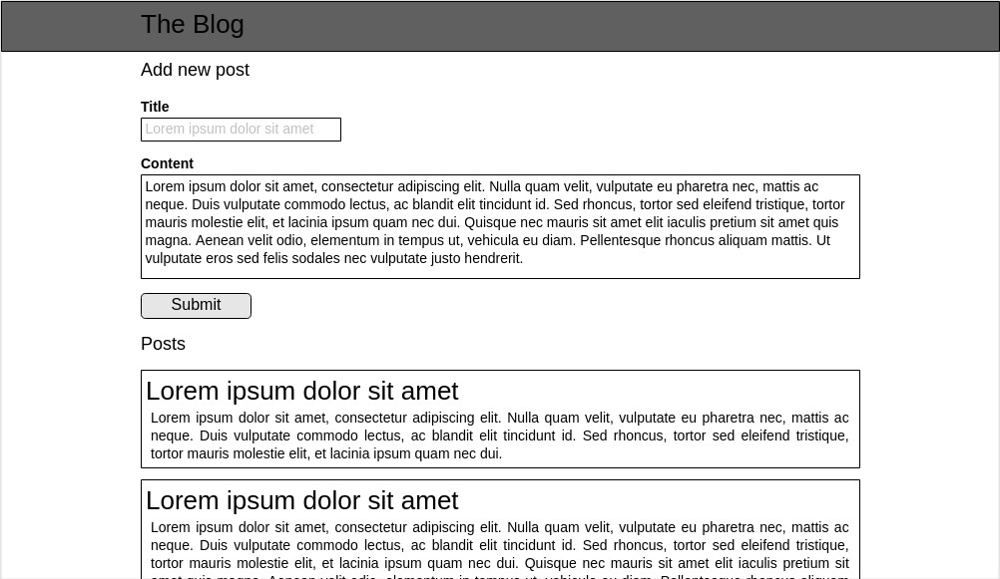

# Blog Project

We are going to build our first big project. It is going to be a blog site
customized by You! For now, focus on the structure and the design in the
following days you are going to make it interactive!

## Layout

## How to start

- Create a new folder for this exercise
- You will need 1 HTML and 1 CSS files
- Think about the HTML structure
  - Header
  - New post section
  - Listing the posts section
- Finish the HTML structure first and then add CSS
  - Why?
    Because the design should not define the structure of our document
- Make it your own: add your design!
