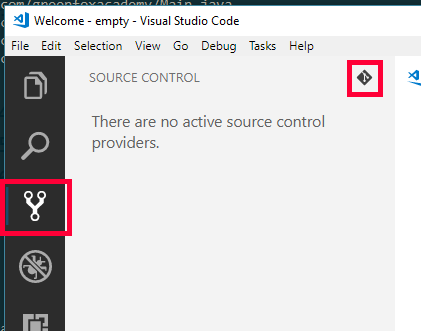
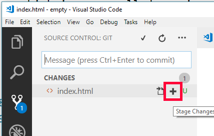
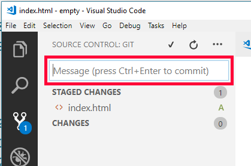

# Deployment

So far you've run your blog on your own computer, and it's time to take the next step. With this guide you'll make your blog available to everyone in the world, so that it'll have it's own address. This is called *deployment*.

## Git

Before actually deploying your app you'll have to learn a bit about *git*, which is a so called version control system. With git you can create save points of your codebase, and can return to the saved state any time in the future. These save points are called *commits*.

To create a commit open the "Source Control" panel in VS Code, then click on "Initialize Repository" button at the upper right hand side of the panel.



Now you have the select each file which you want to include in this commit by clicking on the plus sign next to the file name in the panel.



Every commit must have a so called commits message which is basically a short description of the commit for future reference. Always provide a meaningful commit message.



Finally to create the commit click on the tick at the top of the panel.


## GitHub

GitHub is an online place to store source code and you can have your own storage space, which is a so called *repository*, or repo.

In addition to storing your source code it provides a service called "GitHub pages", which will serve your HTML files on the internet.

### Sign up

Got to [GitHub](http://GitHub.com) and click on the "Sign up" button in the upper right corner of the page. Fill the form and click on the "Create an account" button.

Choose the free plan and leave everything else on the default setting.

Finally, verify your email address by clicking on the link in the email you just received from GitHub.

### Create a new repo

To create a new repository click on the plus sign in the upper right corner on the page and choose "New repository".


The name of the repo should be *yourgithubusername*.github.io, make sure to use the exact same username you used to sign up.


Hit the "Create repository" button.

### Deploy the app

With the repo created you can now deploy your app.

Make sure you have an **index.html** file with content, images and styling. This will be the home page of your blog.

Copy the URL of your repo from GitHub:


The last step must be performed in the terminal window. To open it use the **View > Integrated Terminal** menu command. Type the following instructions, where you should replace the URL with your repo's URL:

``` bash
git remote add origin https://github.com/yourgithubusername/yourgithubusername.github.io.git
git push -u origin master
```

You'll be prompted with a login dialog where you should provide your GitHub username and password.

See your website after a few minutes at http://yourgithubusername.github.io.